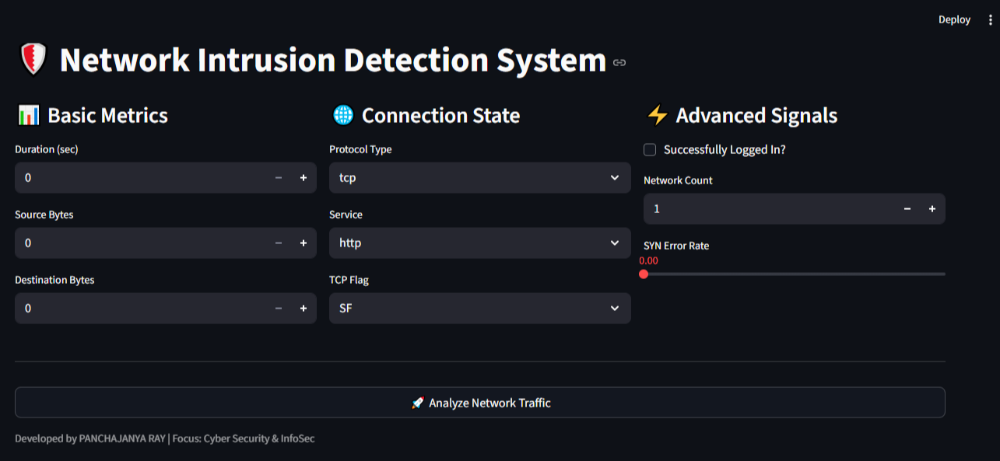

# 🛡️ Network Intrusion Detection System (NIDS)
**Master of Computer Applications (MCA) - Security-Focused ML Portfolio Project**

An end-to-end Machine Learning application built to identify network threats (DoS, Probe, R2L) using the **NSL-KDD dataset**. This project features a **Streamlit UI** and a **Hybrid Detection Logic** to enhance accuracy in stealth attack scenarios.

---

## 🚀 Key Features
- **Real-time Prediction**: Classifies traffic as "Normal" or "Malicious" instantly.
- **XGBoost Classifier**: Optimized for high-speed, high-accuracy classification.
- **Hybrid Heuristics**: Integrated custom logic to catch unauthorized data exfiltration (R2L attacks).
- **Intuitive UI**: Built with Streamlit for a professional-grade security analyst dashboard.

---

## 🧪 Detection Scenarios
The model is trained and tested to detect:
1. **Denial of Service (DoS)**: Recognizing high SYN error rates and half-open connections.
2. **Probing**: Detecting port scans and network mapping attempts.
3. **Data Exfiltration**: Identifying unauthorized large data transfers on unauthenticated sessions.

---

## 🛠️ Tech Stack
- **Language**: Python
- **Libraries**: Scikit-Learn, XGBoost, Pandas, Numpy
- **UI Framework**: Streamlit
- **Model Deployment**: Pickle for serialization

---

## 📂 Project Structure
network-intrusion-detection-system/ 
│── data/ 
│ ├── KDDTest+.txt 
│ └── KDDTrain+.txt 
│ 
│── models 
│ ├── columns.pkl 
│ ├── intrusion_model.pkl 
│ └── scaler.pkl 
│ 
│── notebook/.ipynb_checkpoints 
│ └── network-intrusion-detection-system.ipynb 
│ 
│── README.md 
│ 
│── screenshots/ 
│ ├── DoSAttack(Malicious).png 
│ ├── dataTheft(Malicious).png 
│ ├── loadpage.png 
│ ├── normalWeb(Safe).png 
│ └── portScan(Malicious).png 
│ 
│── app.py 
└── requirements.txt 

---

## 📥 Installation & Usage
~~~
1. Clone the repository:
   git clone [https://github.com/panchajanya-ray/network-intrusion-detection-system.git](https://github.com/your-username/network-intrusion-detection-system.git)

2. Install dependencies:
   pip install -r requirements.txt

3. Run the application:
   streamlit run app.py
~~~

---

## 📸 Screenshots

### Main Interface

### Normal Web (Safe)
.png)

### DoS Attack (Malicious)
.png)

### Data Theft (Malicious)
.png)

### Port Scan (Malicious)
.png)

---

## 👨‍💻 Author

PANCHAJANYA RAY 
MCA Student | ML Engineer 
https://github.com/panchajanya-ray
